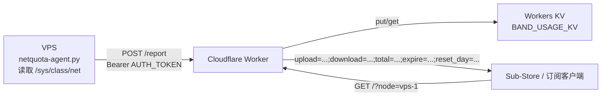

<h1 align="center">netquota</h1>

<p align="center">
  一个运行在 VPS 上的轻量级流量统计工具。它采集网卡流量，定时上报到 Cloudflare Worker，并输出 Sub-Store/订阅工具常用的流量信息格式。
</p>

<p align="center">
  <a href="#快速开始">快速开始</a> ·
  <a href="#配置说明">配置说明</a> ·
  <a href="#sub-store-使用">Sub-Store 使用</a> ·
  <a href="#english-quick-reference">English</a>
</p>

---

## 项目简介

`netquota` 适合把 VPS 的真实网卡流量展示到代理订阅或流量面板里。它由两部分组成：

- `netquota-agent.py`：运行在 VPS 上，读取 Linux 网卡计数器，按月结算窗口累计流量。
- Cloudflare Worker：接收 agent 上报，保存最新流量到 Workers KV，并提供一个公开的查询接口。

查询接口返回纯文本：

```text
upload=123456;download=654321;total=8796093022208;expire=1771862399;reset_day=12
```

这个格式可以被 Sub-Store 这类订阅工具用来展示流量、总量、到期时间和剩余重置天数。

## 特性

- 纯 Python agent，无第三方 Python 依赖。
- 使用 systemd timer 定时采样，默认每 10 分钟一次。
- 支持自动识别默认网卡，也可以手动指定多张网卡。
- 支持三种计费模式：双向计费、只算上传、只算下载。
- 支持按 UTC 月结日自动重置本地累计值。
- 支持手动校准累计流量，方便迁移或和服务商面板对齐。
- Worker 部署在 Cloudflare，使用 Workers KV 保存最新数据。
- GET 查询无数据库依赖，响应快，适合订阅链接读取。

## 架构



## 目录结构

```text
netquota/
├── install.sh                    # VPS 一键安装脚本
├── netquota-agent.py             # VPS 采样与上报 agent
├── netquota-agent.conf.sample    # agent 配置模板
├── netquota.service              # systemd oneshot service
├── netquota.timer                # systemd timer，默认每 10 分钟执行一次
└── worker/
    ├── src/worker.js             # Cloudflare Worker 入口
    └── wrangler.toml             # Wrangler 部署配置
```

## 快速开始

### 1. 部署 Cloudflare Worker

进入 Worker 目录：

```bash
cd netquota/worker
```

登录 Cloudflare：

```bash
npx wrangler login
```

创建 Workers KV namespace：

```bash
npx wrangler kv namespace create BAND_USAGE_KV
```

命令会输出类似下面的内容：

```toml
[[kv_namespaces]]
binding = "BAND_USAGE_KV"
id = "xxxxxxxxxxxxxxxxxxxxxxxxxxxxxxxx"
```

把 `id` 填入 [worker/wrangler.toml](worker/wrangler.toml)：

```toml
[[kv_namespaces]]
binding = "BAND_USAGE_KV"
id = "xxxxxxxxxxxxxxxxxxxxxxxxxxxxxxxx"
```

设置上报密钥。这个密钥只给 VPS agent 使用，不要提交到 Git：

```bash
npx wrangler secret put AUTH_TOKEN
```

部署 Worker：

```bash
npx wrangler deploy
```

部署成功后会得到一个 Worker URL，例如：

```text
https://netquota.your-account.workers.dev
```

### 2. 安装 VPS agent

在 VPS 上克隆项目，并进入项目目录：

```bash
git clone https://github.com/your-name/netquota.git
cd netquota
```

运行安装脚本。`AUTH_TOKEN` 必须和 Worker 里设置的 secret 一致：

```bash
sudo WORKER_URL="https://netquota.your-account.workers.dev" \
  AUTH_TOKEN="change-this-token" \
  NODE_ID="vps-1" \
  RESET_DAY="1" \
  RESET_HOUR_UTC="0" \
  TOTAL_BYTES="8796093022208" \
  EXPIRE_AT="2026-12-31" \
  BILLING_MODE="both" \
  ./install.sh
```

上面的 `TOTAL_BYTES=8796093022208` 表示 8 TiB。你也可以先不传环境变量，脚本会交互式询问 `WORKER_URL`、`AUTH_TOKEN` 和 `NODE_ID`。

安装脚本会做这些事：

- 安装 agent 到 `/usr/local/bin/netquota-agent.py`。
- 安装 systemd unit 到 `/etc/systemd/system/netquota.service` 和 `/etc/systemd/system/netquota.timer`。
- 创建或保留 `/etc/netquota-agent.conf`。
- 创建状态目录 `/var/lib/netquota-agent`。
- 在配置完整时启用并启动 `netquota.timer`。

如果 `/etc/netquota-agent.conf` 已存在，脚本默认不会覆盖它。如需按模板重建配置：

```bash
sudo ./install.sh --force-config
```

### 3. 检查运行状态

查看 timer：

```bash
sudo systemctl status netquota.timer
sudo systemctl list-timers netquota.timer
```

手动执行一次上报：

```bash
sudo /usr/local/bin/netquota-agent.py sample
```

查看本地状态和将要上报的 payload：

```bash
sudo /usr/local/bin/netquota-agent.py status
```

查询 Worker：

```bash
curl "https://netquota.your-account.workers.dev/?node=vps-1"
```

期望输出：

```text
upload=0;download=0;total=8796093022208;expire=1798646399;reset_day=31
```

## 配置说明

agent 配置文件位于：

```text
/etc/netquota-agent.conf
```

| 配置项 | 必填 | 默认值 | 说明 |
|---|---:|---|---|
| `WORKER_URL` | 是 | 无 | Cloudflare Worker URL，不要以 `/` 结尾。 |
| `AUTH_TOKEN` | 是 | 无 | 上报使用的 Bearer token，必须等于 Worker secret `AUTH_TOKEN`。 |
| `NODE_ID` | 否 | 主机名 | 节点标识。查询 Worker 时用 `?node=NODE_ID` 读取对应节点。 |
| `INTERFACES` | 否 | `auto` | 网卡列表，例如 `eth0` 或 `eth0,ens3`。`auto` 会优先读取默认路由网卡。 |
| `RESET_DAY` | 否 | `1` | 每月重置日，按 UTC 计算，范围 `1-31`。如果月份天数不足，会使用该月最后一天。 |
| `RESET_HOUR_UTC` | 否 | `0` | 每月重置小时，按 UTC 计算，范围 `0-23`。 |
| `EXPIRE_AT` | 否 | `0` | 服务到期时间。支持 Unix timestamp、`YYYY-MM-DD`、ISO 时间。 |
| `TOTAL_BYTES` | 否 | `0` | 总流量，单位是 bytes。`0` 表示不展示总量或不限制。 |
| `BILLING_MODE` | 否 | `both` | 计费模式：`both`、`upload`、`download`。 |
| `STATE_FILE` | 否 | `/var/lib/netquota-agent/state.json` | 本地累计状态文件。 |
| `REQUEST_TIMEOUT` | 否 | `10` | 上报 Worker 的超时时间，单位秒。 |
| `INCLUDE_HOSTNAME` | 否 | `true` | 是否在上报 payload 中包含 hostname。 |

### 计费模式

Linux 网卡计数器里：

- `rx_bytes` 是入站流量，对应 `download`。
- `tx_bytes` 是出站流量，对应 `upload`。

不同 VPS 服务商的流量规则不一样：

- 服务商双向计费：使用 `BILLING_MODE=both`。
- 服务商只统计出站流量：使用 `BILLING_MODE=upload`。
- 服务商只统计入站流量：使用 `BILLING_MODE=download`。

### 重置日和到期时间

`RESET_DAY` 是每月流量周期的重置日。agent 会在本地按这个时间清零累计值。

`EXPIRE_AT` 是套餐或服务的到期时间。它不会影响本地流量清零，只会原样转换成 `expire` 字段给订阅工具显示。

注意：Worker 输出里的 `reset_day` 是“距离下一次重置还有多少天”，不是配置里的月结日。

## Sub-Store 使用

在 Sub-Store 或支持订阅流量信息的工具中，把流量信息 URL 设置为：

```text
https://netquota.your-account.workers.dev/?node=vps-1
```

如果只有一个节点，也可以不传 `node`，Worker 会使用默认节点：

```text
https://netquota.your-account.workers.dev/
```

建议每台 VPS 使用不同的 `NODE_ID`，例如：

```text
hk-1
jp-1
us-1
```

然后分别使用：

```text
https://netquota.your-account.workers.dev/?node=hk-1
https://netquota.your-account.workers.dev/?node=jp-1
https://netquota.your-account.workers.dev/?node=us-1
```

## 常用命令

手动采样并上报：

```bash
sudo /usr/local/bin/netquota-agent.py sample
```

查看状态：

```bash
sudo /usr/local/bin/netquota-agent.py status
```

手动重置本地累计值，并上报 0：

```bash
sudo /usr/local/bin/netquota-agent.py reset
```

校准累计上传流量：

```bash
sudo /usr/local/bin/netquota-agent.py calibrate --upload 128GiB
```

校准累计下载流量：

```bash
sudo /usr/local/bin/netquota-agent.py calibrate --download 512GiB
```

同时校准上传和下载：

```bash
sudo /usr/local/bin/netquota-agent.py calibrate --upload 128GiB --download 512GiB
```

支持的单位包括 `KB`、`MB`、`GB`、`TB`、`KiB`、`MiB`、`GiB`、`TiB`。

## Worker API

### `POST /report`

agent 使用这个接口上报流量。需要认证：

```http
Authorization: Bearer <AUTH_TOKEN>
Content-Type: application/json
```

示例 body：

```json
{
  "node_id": "vps-1",
  "upload": 123456,
  "download": 654321,
  "total": 8796093022208,
  "expire": 1798646399,
  "reset_day": 12,
  "ts": "2026-05-29T00:00:00Z",
  "interfaces": ["eth0"],
  "billing_mode": "both"
}
```

### `GET /`

订阅工具读取这个接口。无需认证。

```bash
curl "https://netquota.your-account.workers.dev/?node=vps-1"
```

响应：

```text
upload=123456;download=654321;total=8796093022208;expire=1798646399;reset_day=12
```

### `POST /reset`

可选接口，用于在 Worker 侧强制写入某个节点的 0 流量状态。需要认证。

```bash
curl -X POST "https://netquota.your-account.workers.dev/reset" \
  -H "Authorization: Bearer change-this-token" \
  -H "Content-Type: application/json" \
  --data '{"node_id":"vps-1","total":8796093022208,"expire":1798646399,"reset_day":1}'
```

## 本地开发

### Worker 本地运行

在 `worker/` 目录创建 `.dev.vars`：

```text
AUTH_TOKEN=local-dev-token
```

然后运行：

```bash
npx wrangler dev
```

本地调试时可以手动上报：

```bash
curl -X POST "http://127.0.0.1:8787/report" \
  -H "Authorization: Bearer local-dev-token" \
  -H "Content-Type: application/json" \
  --data '{"node_id":"dev","upload":1,"download":2,"total":100,"expire":0,"reset_day":30}'
```

读取：

```bash
curl "http://127.0.0.1:8787/?node=dev"
```

### agent 使用临时配置

在 Linux 环境中开发 agent 时，可以通过 `NETQUOTA_CONFIG` 指定临时配置文件：

```bash
cp ./netquota-agent.conf.sample /tmp/netquota-agent.conf
$EDITOR /tmp/netquota-agent.conf
NETQUOTA_CONFIG="/tmp/netquota-agent.conf" python3 ./netquota-agent.py status
```

真实 VPS 上建议始终使用 `/etc/netquota-agent.conf`，并确保权限为 `0600`。

## 安全说明

- `AUTH_TOKEN` 用于保护写入接口，不要提交到 Git。
- Cloudflare Worker 中请用 `wrangler secret put AUTH_TOKEN` 设置密钥。
- VPS 上的 `/etc/netquota-agent.conf` 包含 token，安装脚本会设置为 `0600`。
- `GET /` 查询接口默认公开，知道 URL 和 `node` 的人可以看到该节点流量信息。如果这对你是敏感信息，请使用难猜的 `NODE_ID`，或自行在 Worker 中增加读取认证。
- Worker 只保存每个节点的最新一次上报数据，不保存历史流量曲线。

## 排错

### `Unauthorized`

VPS 配置里的 `AUTH_TOKEN` 和 Worker secret 不一致。重新设置 Worker secret：

```bash
cd worker
npx wrangler secret put AUTH_TOKEN
npx wrangler deploy
```

然后确认 `/etc/netquota-agent.conf` 中的 `AUTH_TOKEN` 完全一致。

### `Missing KV binding: BAND_USAGE_KV`

`wrangler.toml` 没有配置正确的 KV namespace id。重新创建或查看 KV namespace，并更新：

```toml
[[kv_namespaces]]
binding = "BAND_USAGE_KV"
id = "xxxxxxxxxxxxxxxxxxxxxxxxxxxxxxxx"
```

### `no interfaces resolved from INTERFACES`

自动识别网卡失败。先查看网卡：

```bash
ip link
ip route show default
```

然后手动设置：

```text
INTERFACES=eth0
```

多网卡用逗号分隔：

```text
INTERFACES=eth0,ens3
```

### timer 没有运行

检查 systemd：

```bash
sudo systemctl status netquota.timer
sudo journalctl -u netquota.service -n 100 --no-pager
```

手动跑一次：

```bash
sudo /usr/local/bin/netquota-agent.py sample
```

### 输出一直是 0

常见原因：

- timer 还没执行过，先手动运行 `sample`。
- `INTERFACES` 指错了网卡。
- Worker 查询 URL 的 `node` 和 VPS 配置的 `NODE_ID` 不一致。
- Worker KV namespace id 配错，数据写入到了另一个 namespace。

## 升级

拉取新版本后重新执行安装脚本即可：

```bash
git pull
sudo ./install.sh
```

脚本默认保留已有 `/etc/netquota-agent.conf`。升级后可以手动执行一次：

```bash
sudo /usr/local/bin/netquota-agent.py sample
```

## 卸载

```bash
sudo ./install.sh --uninstall
```

卸载脚本会移除 agent 和 systemd unit，但会保留：

```text
/etc/netquota-agent.conf
/var/lib/netquota-agent
```

如确认不再需要，可以手动删除配置和状态：

```bash
sudo rm -f /etc/netquota-agent.conf
sudo rm -rf /var/lib/netquota-agent
```

## English Quick Reference

`netquota` is a lightweight VPS traffic collector for subscription traffic displays. A Python agent reads Linux NIC counters, uploads the latest usage to a Cloudflare Worker, and the Worker returns a Sub-Store-friendly plain text response:

```text
upload=123456;download=654321;total=8796093022208;expire=1798646399;reset_day=12
```

Deploy the Worker:

```bash
cd netquota/worker
npx wrangler login
npx wrangler kv namespace create BAND_USAGE_KV
# Put the returned KV id into worker/wrangler.toml.
npx wrangler secret put AUTH_TOKEN
npx wrangler deploy
```

Install the VPS agent:

```bash
sudo WORKER_URL="https://netquota.your-account.workers.dev" \
  AUTH_TOKEN="change-this-token" \
  NODE_ID="vps-1" \
  RESET_DAY="1" \
  TOTAL_BYTES="8796093022208" \
  EXPIRE_AT="2026-12-31" \
  BILLING_MODE="both" \
  ./install.sh
```

Check status:

```bash
sudo systemctl status netquota.timer
sudo /usr/local/bin/netquota-agent.py status
curl "https://netquota.your-account.workers.dev/?node=vps-1"
```

Important configuration:

| Key | Description |
|---|---|
| `WORKER_URL` | Cloudflare Worker URL. |
| `AUTH_TOKEN` | Shared bearer token, same as the Worker secret. |
| `NODE_ID` | Logical node id used by `?node=...`. |
| `INTERFACES` | NIC list, or `auto`. |
| `RESET_DAY` | Monthly reset day in UTC. |
| `EXPIRE_AT` | Service expiration timestamp/date. |
| `TOTAL_BYTES` | Total quota in bytes. |
| `BILLING_MODE` | `both`, `upload`, or `download`. |

The GET endpoint is public by default. Keep `AUTH_TOKEN` secret and use a non-obvious `NODE_ID` if usage data should not be easy to discover.

## License

MIT License. See [LICENSE](LICENSE).
